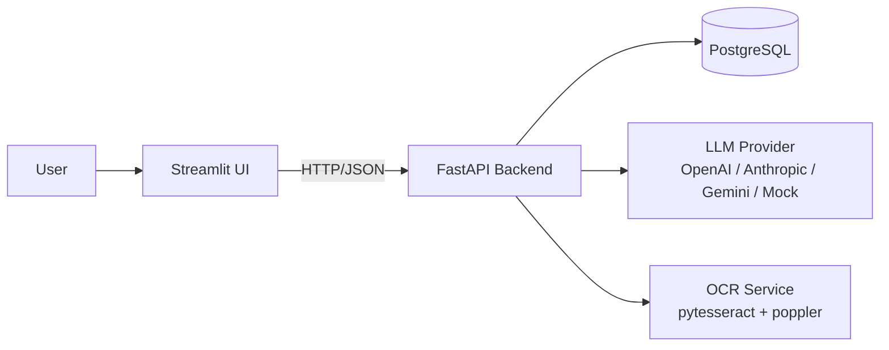
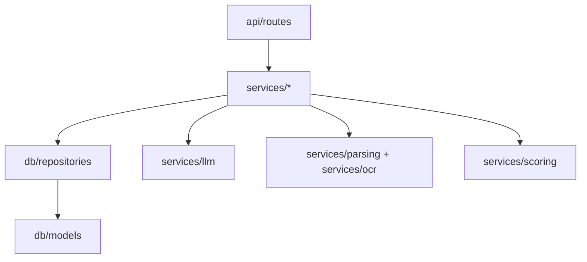
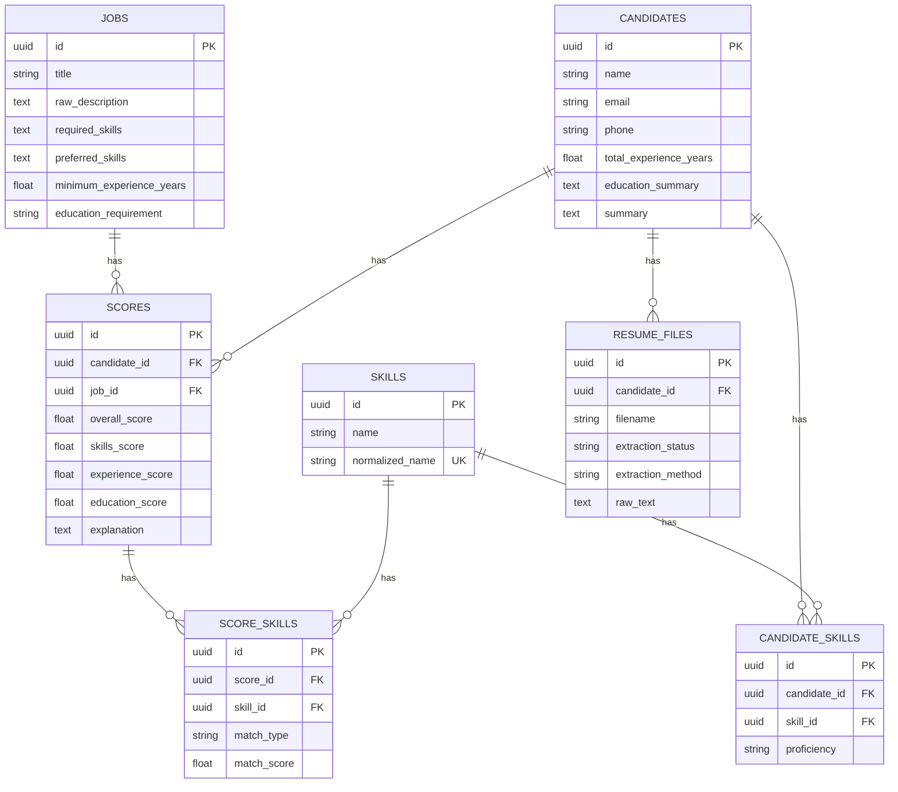
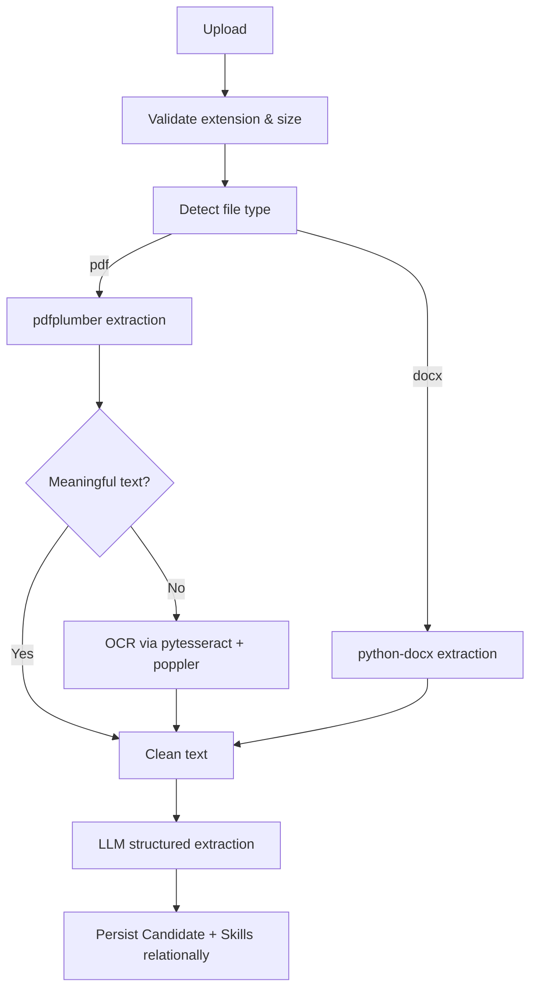

# AI Resume Screening & Candidate Ranking System

An end-to-end AI-powered system that parses resumes (PDF/DOCX, including scanned
PDFs via OCR), extracts structured requirements from job descriptions, and produces
deterministic, explainable candidate scores and rankings — backed by a relational
PostgreSQL schema.

## 1. Project Overview

Recruiters spend hours manually reading resumes and comparing them against job
requirements. This system automates that pipeline: upload a resume, create a job
description, and get an explainable 0–100 match score with matched/missing skills,
strengths, and gaps — plus a ranked leaderboard across all candidates for a role.

## 2. Problem Statement

Given a pool of resumes and one or more job descriptions, produce a transparent,
relationally-queryable candidate ranking that a recruiter can trust and audit,
without hallucinated experience or opaque black-box scores.

## 3. Features

- PDF and DOCX resume parsing, with automatic OCR fallback for scanned PDFs
- LLM-based structured extraction of candidate and job information (provider-agnostic)
- Deterministic, weighted, explainable scoring (skills / experience / education / other)
- Relational skill storage and matching (no core search over JSON blobs)
- Candidate search & filtering (name, email, skill, experience range)
- Candidate detail view with full extracted profile and score history
- Job-based ranking dashboard
- Streamlit UI across 7 pages, calling a FastAPI backend over HTTP
- Dockerized (FastAPI + Streamlit + PostgreSQL)
- Alembic migrations, pytest test suite (22 tests, all mocked — no API keys required)

## 4. Architecture



The Streamlit frontend never talks to PostgreSQL directly. All validation, parsing,
extraction, scoring, persistence, ranking, and search logic live in the backend.

### Backend layering



## 5. Tech Stack

| Layer | Technology |
|---|---|
| Backend framework | FastAPI, Uvicorn, Pydantic v2 |
| ORM / Migrations | SQLAlchemy 2.x, Alembic |
| Database | PostgreSQL (SQLite supported for local dev/tests) |
| Frontend | Streamlit |
| PDF parsing | pdfplumber |
| DOCX parsing | python-docx |
| OCR | pytesseract + pdf2image (poppler) |
| LLM | Custom provider abstraction over OpenAI / Anthropic / Gemini REST APIs, `httpx` |
| Testing | pytest, FastAPI TestClient, reportlab (test fixture generation) |
| Containerization | Docker, docker-compose |

## 6. Project Structure

```
ai-resume-screener/
├── backend/
│   ├── app/
│   │   ├── main.py
│   │   ├── api/routes/            (health, resumes, jobs, candidates, screenings)
│   │   ├── core/                  (config, exceptions, logging)
│   │   ├── db/
│   │   │   ├── models/            (Job, Candidate, Skill, CandidateSkill, ResumeFile, Score, ScoreSkill)
│   │   │   └── repositories/
│   │   ├── schemas/                (Pydantic request/response models)
│   │   ├── services/
│   │   │   ├── parsing/            (pdf, docx, text cleaning)
│   │   │   ├── ocr/
│   │   │   ├── llm/                (provider abstraction: openai/anthropic/gemini/mock)
│   │   │   ├── scoring/            (skill/experience/education matchers + scorer)
│   │   │   └── screening/
│   │   └── utils/                  (file validation, skill normalization)
│   ├── tests/                      (22 tests, mocked LLM, no real API keys needed)
│   ├── alembic/                    (initial schema migration)
│   ├── requirements.txt
│   └── Dockerfile
├── frontend/
│   ├── app.py
│   ├── pages/                      (Dashboard, Upload Resume, Create Job, Candidates,
│   │                                Candidate Details, Screen Candidate, Ranking Dashboard)
│   ├── services/api_client.py
│   └── Dockerfile
├── docker-compose.yml
├── .env.example
└── README.md
```

## 7. Database Schema



Candidate skill search and filtering query the relational
`candidates → candidate_skills → skills` path directly (see
`CandidateRepository.search`); no core search depends on JSON blobs.

## 8. Data Flow — Resume Processing



## 9. LLM Architecture

The system is provider-agnostic via a small `LLMProvider` abstraction
(`services/llm/base.py`) with concrete implementations calling each provider's
REST API directly over `httpx` (no heavyweight SDK lock-in):

- `OpenAIProvider` — Chat Completions with JSON schema response format
- `AnthropicProvider` — Messages API with schema embedded in the system prompt
- `GeminiProvider` — `generateContent` with `responseSchema`
- `MockProvider` — deterministic heuristic extraction (regex + keyword matching),
  used automatically when `LLM_PROVIDER=mock` or in tests, so the whole system is
  runnable and testable **without any API key**.

Selected via `LLM_PROVIDER` env var. All extraction goes through Pydantic models
(`ResumeExtraction`, `JobExtraction`) with validation and a bounded retry
(`LLMService._extract_with_retry`); a failure raises a controlled `LLMProviderError`
(HTTP 502) rather than crashing the API.

Screening itself never re-sends raw resume/JD text to the LLM — it operates on the
already-extracted structured Candidate and Job records, and the actual 0–100 score
is computed by deterministic application code (`services/scoring/scorer.py`), not
by the LLM.

## 10. OCR Architecture

`services/parsing/resume_extractor.py` implements the decision:

1. DOCX → always `python-docx`.
2. PDF → try `pdfplumber` first.
3. If extracted text length is below `OCR_MIN_TEXT_CHARS` (default 50), fall back to
   OCR: `pdf2image.convert_from_path` (requires the `poppler-utils` system package
   for `pdftoppm`) rasterizes each page, then `pytesseract.image_to_string` (requires
   the `tesseract-ocr` system package) extracts text.

Both system dependencies are installed in `backend/Dockerfile` via `apt-get install
tesseract-ocr poppler-utils` — the Python packages (`pytesseract`, `pdf2image`)
alone are **not** sufficient without these binaries.

## 11. Setup

### Prerequisites
- Python 3.11+
- PostgreSQL 14+ (or use Docker Compose, or SQLite for quick local testing)
- `tesseract-ocr` and `poppler-utils` system packages if running OCR locally
  outside Docker (`apt-get install tesseract-ocr poppler-utils` on Debian/Ubuntu)

### Environment Variables

Copy `backend/.env.example` to `backend/.env` and fill in values:

| Variable | Purpose |
|---|---|
| `APP_ENV` | `development` / `production` |
| `LOG_LEVEL` | Python logging level |
| `DATABASE_URL` | SQLAlchemy connection string (Postgres or SQLite) |
| `LLM_PROVIDER` | `mock` / `openai` / `anthropic` / `gemini` |
| `LLM_MODEL` | Model name for the selected provider |
| `OPENAI_API_KEY` / `GEMINI_API_KEY` / `ANTHROPIC_API_KEY` | Only the key matching `LLM_PROVIDER` is required |
| `MAX_UPLOAD_SIZE_MB` | Upload size limit |

`LLM_PROVIDER=mock` requires **no API key** and is the default — the whole system
is fully runnable and demoable without any LLM subscription.

## 12. Database Migrations

```bash
cd backend
alembic upgrade head
```

The initial migration (`alembic/versions/590c3778d160_initial_schema.py`) creates
all seven tables with foreign keys, indexes, and the unique constraint on
`skills.normalized_name`. Verified locally against both SQLite and (schema-compatible)
PostgreSQL DDL generated by SQLAlchemy.

## 13. Running Locally

### Backend
```bash
cd backend
python -m venv venv && source venv/bin/activate
pip install -r requirements.txt
cp .env.example .env   # edit DATABASE_URL, LLM_PROVIDER, etc.
alembic upgrade head
uvicorn app.main:app --reload --port 8000
```

### Frontend
```bash
cd frontend
python -m venv venv && source venv/bin/activate
pip install -r requirements.txt
export API_BASE_URL=http://localhost:8000
streamlit run app.py
```

## 14. Running with Docker

```bash
docker compose up --build
```

This starts PostgreSQL, the FastAPI backend (running `alembic upgrade head` on
container start), and the Streamlit frontend. By default `LLM_PROVIDER=mock`, so
it works immediately with no API keys — set `LLM_PROVIDER` and the matching
`*_API_KEY` in your shell (or a `.env` file next to `docker-compose.yml`) to use a
real provider.

- Backend: http://localhost:8000 (Swagger at `/docs`)
- Frontend: http://localhost:8501

> **Note on verification**: this sandbox environment does not have a Docker daemon
> available, so `docker compose up --build` itself could not be executed here. The
> `Dockerfile`s and `docker-compose.yml` were reviewed line-by-line against the
> verified-working local run (same commands: `pip install -r requirements.txt`,
> `alembic upgrade head`, `uvicorn app.main:app`, `streamlit run app.py`), and the
> backend was fully exercised locally via `uvicorn` (see Testing/Verification
> sections). Please run `docker compose up --build` on your machine to confirm the
> container build; report back if anything needs adjusting.

## 15. Streamlit Usage

1. **Dashboard** — recruitment metrics: totals, average score, top candidates.
2. **Upload Resume** — upload PDF/DOCX, see extraction status and the created candidate.
3. **Create Job** — paste a JD, see extracted required/preferred skills.
4. **Candidates** — search/filter by name, email, skill, experience range.
5. **Candidate Details** — paste a candidate ID to see the full profile.
6. **Screen Candidate** — pick a candidate + job, get an explainable score.
7. **Ranking Dashboard** — pick a job, see all screened candidates ranked by score.

## 16. API Documentation

Swagger UI: `http://localhost:8000/docs` · ReDoc: `http://localhost:8000/redoc`
Full OpenAPI schema is generated from the FastAPI routes/Pydantic models, including
request bodies, response schemas, and validation error shapes.

## 17. API Examples

**Create a job**
```bash
curl -X POST http://localhost:8000/api/jobs \
  -H "Content-Type: application/json" \
  -d '{"title": "Backend Engineer", "raw_description": "Need Python, FastAPI, SQL. 2+ years. Bachelor degree."}'
```

**Upload a resume**
```bash
curl -X POST http://localhost:8000/api/resumes/upload \
  -F "file=@/path/to/resume.pdf"
```

**Run a screening**
```bash
curl -X POST http://localhost:8000/api/screenings \
  -H "Content-Type: application/json" \
  -d '{"candidate_id": "<uuid>", "job_id": "<uuid>"}'
```

**Get a screening result**
```bash
curl http://localhost:8000/api/screenings/<screening_id>
```

**Search candidates**
```bash
curl "http://localhost:8000/api/candidates/search?skill=python&min_experience=2"
```

**Get job rankings**
```bash
curl http://localhost:8000/api/jobs/<job_id>/rankings
```

## 18. Testing

```bash
cd backend
pip install -r requirements.txt -r requirements-dev.txt
pytest tests/ -v
```

22 tests, all passing, none requiring a real API key (`LLM_PROVIDER=mock` is forced
in `tests/conftest.py`). Coverage includes: health check, PDF extraction
(`pdfplumber`, via a generated text PDF), DOCX extraction, OCR fallback (via a
generated *image-only* PDF, exercising the real `pytesseract`/`poppler` pipeline),
invalid file type, empty file, malformed DOCX, JD creation, candidate creation,
candidate search by skill and by experience range, screening creation, score range
validation (0–100), job rankings, screening/candidate/job not-found cases.

## 19. Deployment

### Render / Railway (recommended for this assessment)

**PostgreSQL**: provision a managed Postgres instance; copy its connection string.

**Backend (FastAPI)**
- Build command: `pip install -r backend/requirements.txt`
- Start command: `alembic upgrade head && uvicorn app.main:app --host 0.0.0.0 --port $PORT`
- Root directory: `backend`
- Env vars: `DATABASE_URL` (from the managed Postgres), `LLM_PROVIDER`, the matching
  `*_API_KEY`, `MAX_UPLOAD_SIZE_MB`
- Health check path: `/api/health`

**Frontend (Streamlit)**
- Build command: `pip install -r frontend/requirements.txt`
- Start command: `streamlit run app.py --server.port $PORT --server.address 0.0.0.0`
- Root directory: `frontend`
- Env vars: `API_BASE_URL` = the deployed backend's public URL

**Migrations**: run automatically as part of the backend start command above; can
also be run manually via the platform's one-off/shell command with
`alembic upgrade head`.

> This system was **not** actually deployed to Render/Railway from this
> environment (no outbound access to those platforms here) — the instructions
> above are exact commands, not a claim of a verified live deployment. Local and
> in-process verification is documented in section 20.

## 20. Design Decisions

- **Provider-agnostic LLM via direct REST calls**, not a heavy SDK/LangChain
  dependency — keeps the dependency surface small and the abstraction easy to audit.
- **Deterministic scoring in application code**, LLM only for structured extraction
  — required for explainability and reproducibility; a rerun of the same screening
  input always yields the same score.
- **Skills stored relationally** with a `normalized_name` unique constraint and a
  small alias table (`utils/normalization.py`) rather than a large synonym database
  — maintainable, extensible, and keeps search on indexed columns.
- **`required_skills`/`preferred_skills`/etc. stored as `|`-delimited text** on
  `jobs` rather than a normalized join table — these are read as a whole per-job and
  never filtered on directly (skill *search* goes through the proper
  `CandidateSkill` join table instead), so a simpler representation was chosen
  for this field specifically, documented here per the "reasonable industry-standard
  decision" allowance in the brief.
- **SQLite supported alongside PostgreSQL** for local dev/tests via a portable `GUID`
  TypeDecorator — production still targets PostgreSQL (`docker-compose.yml` and
  `.env.example` both default to Postgres); this was a deliberate call to make the
  test suite fast and dependency-free while keeping the production path unchanged.
- **File storage on local disk** (`backend/storage/resumes/`) — acceptable per the
  brief for this assessment; `ResumeFile.storage_path` is a plain string, so
  swapping to S3/GCS later only touches `ResumeService`.

## 21. Security Considerations

- Upload validation: extension allow-list (`pdf`, `docx`), size cap
  (`MAX_UPLOAD_SIZE_MB`), empty-file rejection.
- No secrets logged; API keys read only from environment variables, never committed
  (`.env` is git-ignored, `.env.example` has empty values).
- SQLAlchemy ORM used throughout — no raw string-interpolated SQL, so parameterized
  queries by construction.
- Exception handling never leaks stack traces, SQL, or internal error text to the
  client — `AppError` subclasses map to clean HTTP status codes and messages only.
- No sensitive personal attributes (beyond name/email/phone, which are necessary for
  identification) are used in the scoring calculation.
- No authentication was implemented, per the brief's instruction not to add auth
  unless required — **do not expose this deployment publicly without adding auth
  first** if handling real candidate data.

## 22. Known Limitations

- No authentication/authorization layer.
- `MockProvider`'s extraction is heuristic (regex/keyword-based), not a real LLM —
  good for deterministic testing and demoing without API keys, but noticeably less
  accurate than a real provider on messy/unusual resume formats. Set `LLM_PROVIDER`
  to `openai`/`anthropic`/`gemini` with a real key for production-quality extraction.
- Docker build was not executed in this environment (no Docker daemon available);
  verify `docker compose up --build` on a machine with Docker installed.
- Skill alias table is intentionally small; uncommon synonyms won't be normalized.
- No pagination cursor — `limit`/`offset` only, fine at assessment scale but would
  need cursor-based pagination for very large candidate tables.
- Candidate matching to a resume upload always creates a new `Candidate` row — no
  duplicate-detection/merge logic if the same person uploads twice with a different
  resume file.

## 24. Troubleshooting

**Frontend container exits with code 139 (segfault)**: this is a known Streamlit
issue with its file-watcher segfaulting inside slim Docker images on some
host/Docker combinations — it is unrelated to your data or API calls (check the
backend logs; if your requests show `200`/`201` before the crash, the app itself
worked fine). Already mitigated in `frontend/Dockerfile`
(`--server.fileWatcherType=none`) and `docker-compose.yml`
(`restart: unless-stopped` on both `frontend` and `backend`), so a fresh
`docker compose up --build` should no longer hit this. If it recurs locally
(non-Docker), run `streamlit run app.py --server.fileWatcherType none`.

**Sidebar shows garbled text / `switch_page` can't find a page file**: earlier
revisions used emoji characters directly in page filenames
(e.g. `1_📊_Dashboard.py`) to get icons in the sidebar. This is fragile —
Docker's build layer and some filesystems don't reliably preserve UTF-8 filenames,
which both garbles the sidebar text and breaks `st.switch_page()` since the actual
on-disk filename no longer matches. Fixed by switching to Streamlit's
`st.navigation()` / `st.Page()` API (`frontend/app.py`): page files are now plain
ASCII (`pages/dashboard.py`, etc.) and icons are set explicitly in code
(`st.Page(..., icon="📊")`), which is encoding-safe. `frontend/Dockerfile` also
sets `LANG=C.UTF-8` as defense in depth.

**App looks inconsistent between light/dark mode**: the custom CSS in
`components/theme.py` was designed for a light UI (white cards, dark text), so a
browser/OS dark-mode preference could clash with it. `frontend/.streamlit/config.toml`
now pins `base = "light"` with an explicit color palette, so the app renders
consistently regardless of the visitor's system theme.

## 23. Future Improvements

- Real deduplication of candidates by email/phone across multiple resume uploads.
- Object storage (S3/GCS) for resume files instead of local disk.
- Background job queue for resume processing (currently synchronous per-request).
- Bulk "screen all candidates against this job" endpoint for the ranking dashboard,
  rather than one screening call per candidate.
- Configurable scoring weights per job (currently a global default of 40/30/20/10).
- Authentication and role-based access (recruiter vs. admin).
