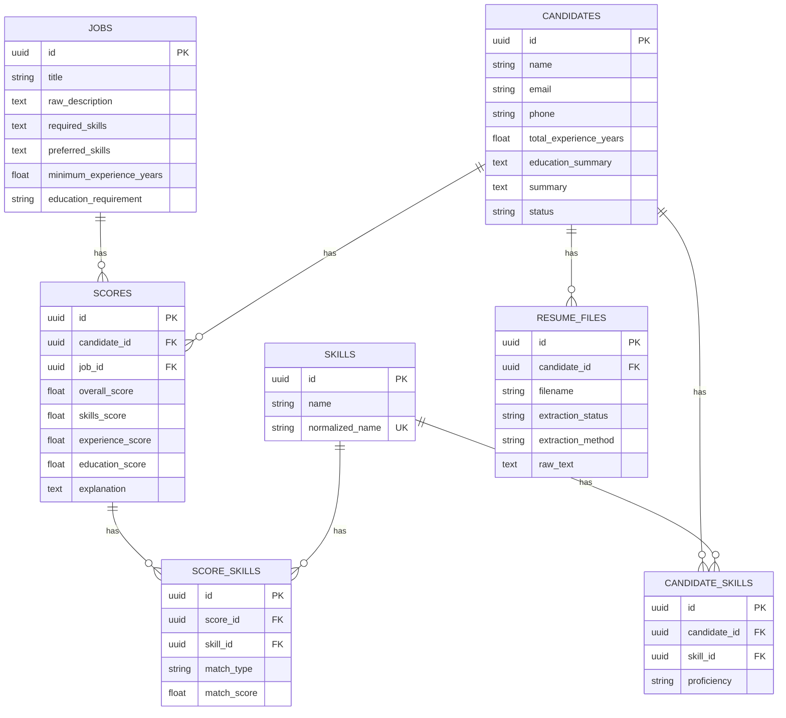
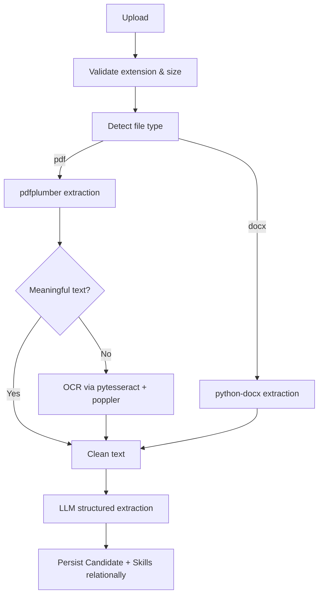
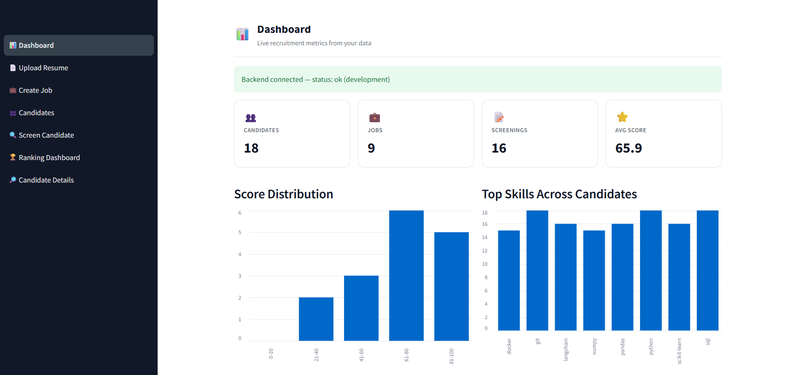
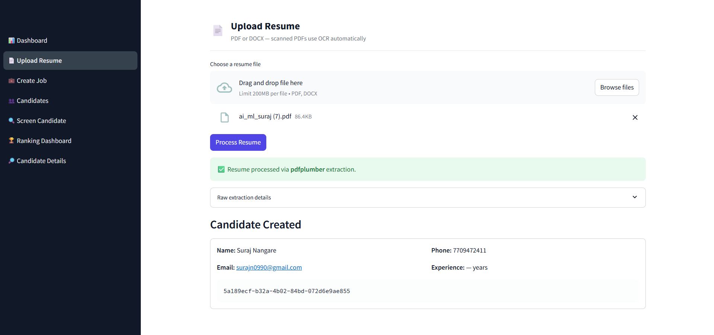
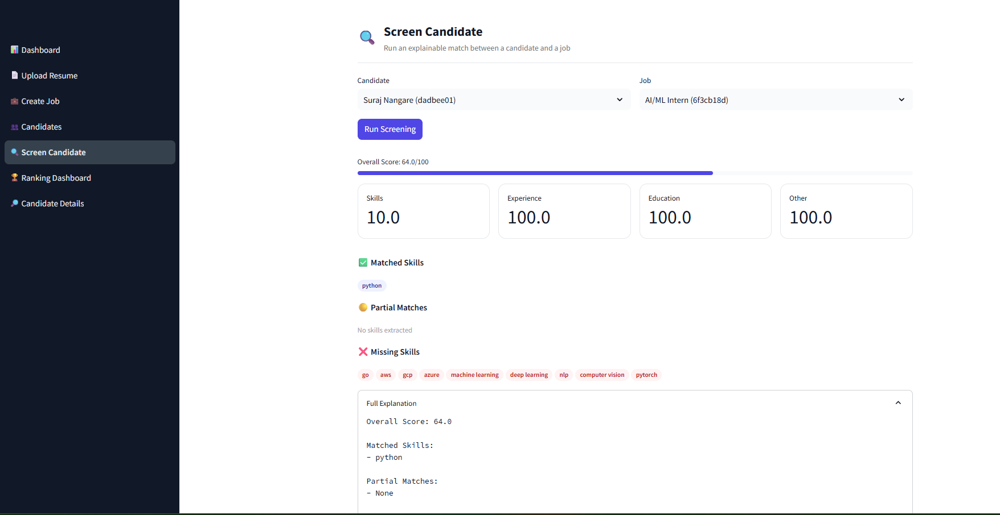
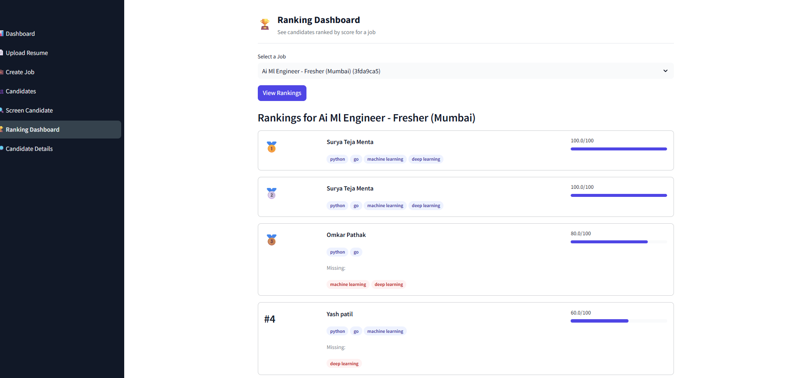
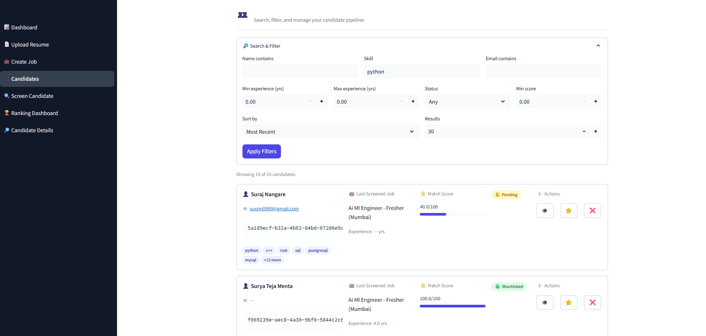

## 7. Database Schema



Candidate skill search and filtering query the relational
`candidates → candidate_skills → skills` path directly (see
`CandidateRepository.search`); no core search depends on JSON blobs.

## 8. Data Flow — Resume Processing



## 9. LLM Architecture

The system is provider-agnostic via a small `LLMProvider` abstraction
(`services/llm/base.py`) with concrete implementations calling each provider's
REST API directly over `httpx` (no heavyweight SDK lock-in):

- `GeminiProvider` — `generateContent` with `responseSchema`
- `OpenAIProvider` — also powers Groq, OpenRouter, and Ollama, since all four
  speak the same OpenAI-compatible chat completions format (switch provider by
  changing one environment variable, no code change needed)
- `AnthropicProvider` — Messages API with schema embedded in the system prompt
- `MockProvider` — deterministic heuristic extraction (regex + keyword matching),
  used automatically when `LLM_PROVIDER=mock` or in tests, so the whole system is
  runnable and testable **without any API key**

Selected via the `LLM_PROVIDER` environment variable. All extraction goes through
Pydantic models (`ResumeExtraction`, `JobExtraction`) with validation and a bounded
retry; a failure raises a controlled `LLMProviderError` (HTTP 502) instead of
crashing the API.

Screening itself never re-sends raw resume/JD text to the LLM — it operates on the
already-extracted structured Candidate and Job records, and the actual 0–100 score
is computed by deterministic application code (`services/scoring/scorer.py`), not
by the LLM. This guarantees the same candidate scored against the same job always
produces the same score.

## 10. OCR Architecture

`services/parsing/resume_extractor.py` implements the decision:

1. DOCX → always `python-docx`.
2. PDF → try `pdfplumber` first.
3. If extracted text length is below `OCR_MIN_TEXT_CHARS` (default 50), fall back to
   OCR: `pdf2image.convert_from_path` (requires the `poppler-utils` system package)
   rasterizes each page, then `pytesseract.image_to_string` (requires the
   `tesseract-ocr` system package) extracts text.

Both system dependencies are installed automatically in `backend/Dockerfile`.

## 11. Email Notifications & Interview Scheduling

After every screening, a background task (`services/notifications/notification_service.py`)
decides what happens next based on the candidate's score — this runs *after* the
HTTP response is already sent, so it never slows down the recruiter's screen:

| Score | Action |
|---|---|
| ≥ `SHORTLIST_SCORE_THRESHOLD` (default 70) | Shortlist email sent; candidate status auto-updated to `shortlisted` |
| ≥ `SCHEDULE_LINK_SCORE_THRESHOLD` (default 80) | Shortlist email additionally includes a Cal.com interview scheduling link |
| < `REJECT_SCORE_THRESHOLD` (default 40) | Rejection email sent with specific, AI-derived feedback on the skill gap; status auto-updated to `rejected` |
| In between | "Under review" email sent; status unchanged |

**Email delivery** is provider-agnostic (`services/notifications/email_service.py`):
supports SMTP (e.g. Gmail with an App Password) or SendGrid — selected via
`EMAIL_PROVIDER`. All three email templates (shortlist / rejection / under-review)
are styled HTML with a score badge and clear next steps.

**Interview scheduling** uses a Cal.com public booking link — no OAuth or API key
required, just your event URL, with the candidate's name and email pre-filled via
query parameters.

Notifications are **off by default** (`NOTIFICATIONS_ENABLED=false`) so the system
runs fully without any email setup; enable it once SMTP/SendGrid credentials are
configured.

## 12. Prerequisites — What You Need to Run This

- **Docker & Docker Compose** (recommended — runs backend, frontend, and PostgreSQL
  together with one command), *or* Python 3.11+ and a local/managed PostgreSQL
  instance if running without Docker
- **One LLM API key** (only one is required):
  - Gemini — free tier available at [ai.google.dev](https://ai.google.dev)
  - Groq — free tier, OpenAI-compatible, at [console.groq.com](https://console.groq.com)
  - OpenAI or Anthropic (paid)
  - Or skip this entirely — `LLM_PROVIDER=mock` runs the whole system with no API
    key at all, using deterministic heuristic extraction
- **Optional, for email notifications**: an SMTP account (e.g. Gmail with a
  2FA-enabled App Password) or a SendGrid API key
- **Optional, for interview scheduling links**: a free [Cal.com](https://cal.com)
  account with one event type set up

## 13. Setup

### Environment Variables

Copy `backend/.env.example` to `backend/.env` and fill in values:

| Variable | Purpose |
|---|---|
| `APP_ENV` | `development` / `production` |
| `DATABASE_URL` | SQLAlchemy connection string (Postgres or SQLite) |
| `LLM_PROVIDER` | `mock` / `gemini` / `openai` / `anthropic` / `groq` / `openrouter` / `ollama` |
| `LLM_MODEL` | Model name for the selected provider |
| `GEMINI_API_KEY` / `OPENAI_API_KEY` / `ANTHROPIC_API_KEY` / `GROQ_API_KEY` | Only the key matching `LLM_PROVIDER` is required |
| `MAX_UPLOAD_SIZE_MB` | Upload size limit |
| `NOTIFICATIONS_ENABLED` | `true`/`false` — enables the email automation layer |
| `EMAIL_PROVIDER` | `none` / `smtp` / `sendgrid` |
| `SMTP_HOST` / `SMTP_USERNAME` / `SMTP_PASSWORD` / `SMTP_FROM_EMAIL` | Required if `EMAIL_PROVIDER=smtp` |
| `SENDGRID_API_KEY` / `SENDGRID_FROM_EMAIL` | Required if `EMAIL_PROVIDER=sendgrid` |
| `SHORTLIST_SCORE_THRESHOLD` / `REJECT_SCORE_THRESHOLD` / `SCHEDULE_LINK_SCORE_THRESHOLD` | Score cutoffs for notification tiers |
| `CALCOM_SCHEDULING_URL` | Your public Cal.com event link, for interview scheduling |
| `COMPANY_NAME` | Used in email templates |

`LLM_PROVIDER=mock` requires **no API key** and is the default — the whole system
is fully runnable and demoable without any LLM subscription.

## 14. Database Migrations

```bash
cd backend
alembic upgrade head
```

Migrations create all tables — Jobs, Candidates, Skills, CandidateSkills,
ResumeFiles, Scores, ScoreSkills — with foreign keys, indexes, and the unique
constraint on `skills.normalized_name`.

## 15. Running Locally

### Backend
```bash
cd backend
python -m venv venv && source venv/bin/activate
pip install -r requirements.txt
cp .env.example .env   # edit DATABASE_URL, LLM_PROVIDER, etc.
alembic upgrade head
uvicorn app.main:app --reload --port 8000
```

### Frontend
```bash
cd frontend
python -m venv venv && source venv/bin/activate
pip install -r requirements.txt
export API_BASE_URL=http://localhost:8000
streamlit run app.py
```

## 16. Running with Docker

```bash
docker compose up --build
```

This starts PostgreSQL, the FastAPI backend (running migrations automatically on
startup), and the Streamlit frontend.

- Backend: http://localhost:8000 (Swagger at `/docs`)
- Frontend: http://localhost:8501

## 17. Streamlit Usage

1. **Dashboard** — recruitment metrics: totals, average score, score distribution
   and top-skills charts, top and recent candidates.
2. **Upload Resume** — upload PDF/DOCX, see extraction status and the created candidate.
3. **Create Job** — paste a JD, see extracted required/preferred skills.
4. **Candidates** — search/filter by name, email, skill, experience range, and
   status; shortlist or reject candidates directly from the table.
5. **Candidate Details** — full profile, skills, and screening history.
6. **Screen Candidate** — pick a candidate + job, get an explainable score.
7. **Ranking Dashboard** — pick a job, see all screened candidates ranked by score.

## 18. Screenshots

### Dashboard


### Upload Resume


### Screening Result


### Ranking Dashboard


### Candidates


## 19. API Documentation

Swagger UI: `http://localhost:8000/docs` · ReDoc: `http://localhost:8000/redoc`
Full OpenAPI schema is generated from the FastAPI routes/Pydantic models, including
request bodies, response schemas, and validation error shapes.

## 20. API Examples

**Create a job**
```bash
curl -X POST http://localhost:8000/api/jobs \
  -H "Content-Type: application/json" \
  -d '{"title": "Backend Engineer", "raw_description": "Need Python, FastAPI, SQL. 2+ years. Bachelor degree."}'
```

**Upload a resume**
```bash
curl -X POST http://localhost:8000/api/resumes/upload \
  -F "file=@/path/to/resume.pdf"
```

**Run a screening** (triggers email notification automatically if enabled)
```bash
curl -X POST http://localhost:8000/api/screenings \
  -H "Content-Type: application/json" \
  -d '{"candidate_id": "<uuid>", "job_id": "<uuid>"}'
```

**Update candidate status**
```bash
curl -X PATCH http://localhost:8000/api/candidates/<candidate_id>/status \
  -H "Content-Type: application/json" \
  -d '{"status": "shortlisted"}'
```

**Search candidates**
```bash
curl "http://localhost:8000/api/candidates/search?skill=python&min_experience=2&status=shortlisted"
```

**Get job rankings**
```bash
curl http://localhost:8000/api/jobs/<job_id>/rankings
```

## 21. Testing

```bash
cd backend
pip install -r requirements.txt -r requirements-dev.txt
pytest tests/ -v
```

35 tests, all passing, none requiring a real API key (`LLM_PROVIDER=mock` is forced
in `tests/conftest.py`). Coverage includes: health check, PDF and DOCX extraction,
OCR fallback (exercising the real `pytesseract`/`poppler` pipeline against a
generated image-only PDF), file validation edge cases, JD and candidate creation,
candidate search and status filtering, screening creation and score range
validation, job rankings, email notification decision logic and templates, and
not-found error handling across all resources.

## 22. Deployment

### Render / Railway

**PostgreSQL**: provision a managed Postgres instance; copy its connection string.

**Backend (FastAPI)**
- Build command: `pip install -r backend/requirements.txt`
- Start command: `alembic upgrade head && uvicorn app.main:app --host 0.0.0.0 --port $PORT`
- Root directory: `backend`
- Env vars: as listed in section 13
- Health check path: `/api/health`

**Frontend (Streamlit)**
- Build command: `pip install -r frontend/requirements.txt`
- Start command: `streamlit run app.py --server.port $PORT --server.address 0.0.0.0`
- Root directory: `frontend`
- Env vars: `API_BASE_URL` = the deployed backend's public URL

## 23. Design Decisions

- **Provider-agnostic LLM via direct REST calls**, not a heavy SDK/LangChain
  dependency — keeps the dependency surface small and the abstraction easy to audit.
- **Deterministic scoring in application code**, LLM only for structured extraction
  — required for explainability and reproducibility; a rerun of the same screening
  input always yields the same score.
- **Skills stored relationally** with a `normalized_name` unique constraint and a
  small alias table rather than a large synonym database — maintainable,
  extensible, and keeps search on indexed columns.
- **Notifications run as background tasks**, decoupled from the request/response
  cycle — a slow or failed email send never blocks or delays the recruiter seeing
  the screening result.
- **Cal.com over Google Calendar API** for scheduling — a public booking link
  requires no OAuth setup, making the feature usable in minutes rather than requiring
  a full calendar integration flow.
- **SQLite supported alongside PostgreSQL** for local dev/tests via a portable `GUID`
  TypeDecorator — production targets PostgreSQL by default in `docker-compose.yml`
  and `.env.example`.

## 24. Security Considerations

- Upload validation: extension allow-list (`pdf`, `docx`), size cap, empty-file rejection.
- No secrets logged; API keys and SMTP credentials read only from environment
  variables, never committed (`.env` is git-ignored, `.env.example` has empty values).
- SQLAlchemy ORM used throughout — no raw string-interpolated SQL, parameterized
  queries by construction.
- Exception handling never leaks stack traces, SQL, or internal error text to the
  client.
- No sensitive personal attributes beyond name/email/phone (necessary for
  identification) are used in the scoring calculation.
- No authentication layer is included by default; recommended to add before
  exposing any deployment publicly with real candidate data.

## 25. Roadmap

- Authentication and role-based access (recruiter vs. admin).
- Real deduplication of candidates by email/phone across multiple resume uploads.
- Object storage (S3/GCS) for resume files instead of local disk.
- Background job queue (e.g. Celery) for higher-volume resume processing.
- Bulk "screen all candidates against this job" endpoint for the ranking dashboard.
- Configurable scoring weights per job role.
- Google Calendar API integration as an alternative to Cal.com for enterprises
  already standardized on Google Workspace.